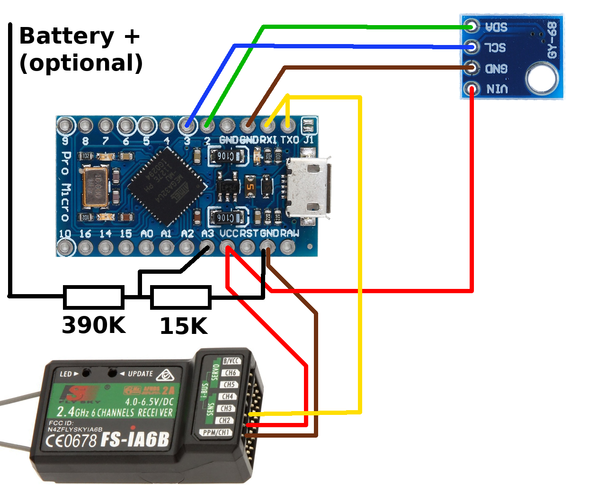
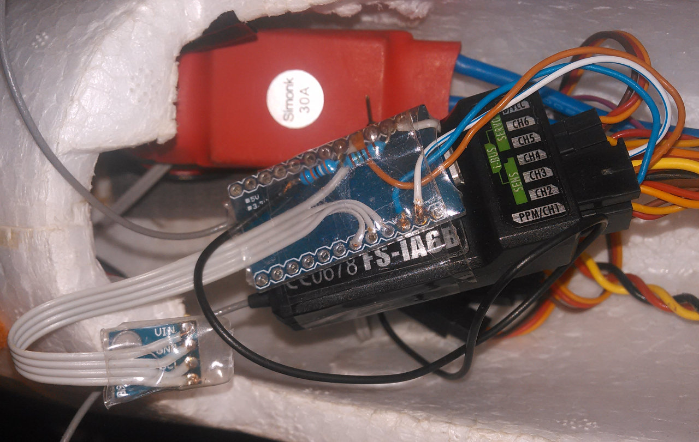
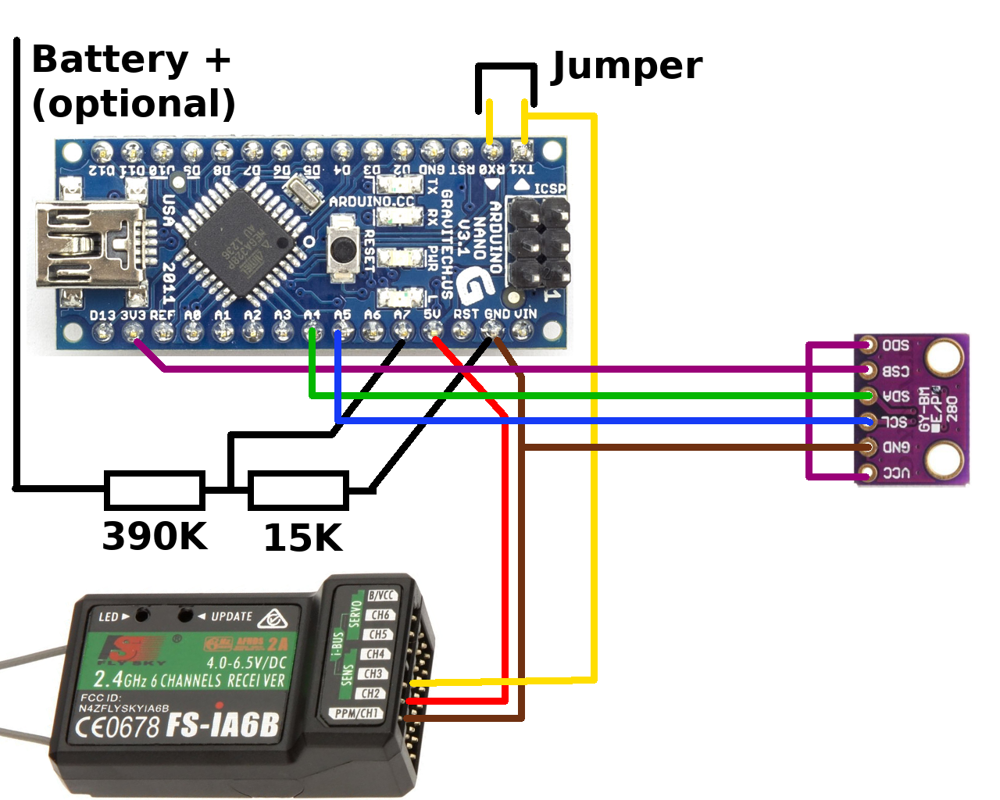

# I-Bus Altitude Sensor for FlySky Telemetry

## Requirements

* FlySky transmitter with AFHDS-2A telemetry. Preferably FS-i6 with
  modified [firmware from qba667](https://github.com/qba667/FlySkyI6).
* Receiver with I-Bus sensor input, such as FS-iA6B. No firmware modification
  required.
* Atmel AVR-based board. Tested with SparkFun
  [ProMicro](https://www.sparkfun.com/products/12640) clone, and
  [Arduino Nano](https://www.arduino.cc/en/Guide/ArduinoNano) clone.
  ProMicro is about the lightest but powerful ATmega-based board.
  Nano is a bit heavier, but it has 3.3V dedicated output, so that
  it can be directly used with BMP-280 breakout board.
* Supported pressure sensor with I2C on a break-out board. Currently
  supported is BMP-180 on a GY-68 board, and BMP-280 break-out board.
  The later is more precise, but it requires 3.3 V power.
* 390K and 15K resistors for voltage divider for reading the battery
  voltage (optional).
* some wires and a 3-pin servo female connector for I-Bus.
* AVR toolchain (avr-gcc, avr-libc, avrdude, make, ...).

## Wiring

Here is how to connect things together:

And here is my (rather messy) real-world example in Sky Surfer 1400:

Here is the version with Arduino Nano and BMP-280:

## Firmware

The firmware is based on the following libraries:

* AVR [BMP085 library](https://davidegironi.blogspot.cz/2012/10/avr-atmega-bmp085-pressure-sensor.html) by Davide Gironi
* AVR [BMP280 library](https://github.com/Yenya/avr-bmp280) by Yours Truly.
* [I2C/TWI master library](http://homepage.hispeed.ch/peterfleury/doxygen/avr-gcc-libraries/group__pfleury__ic2master.html) by Peter Fleury

The I-Bus code is in the main file [ibus-sensor.c](ibus-sensor.c).
It provides the following sensors:

* Temperature sensor from BMPxxx
* Altitude relative to the power-on value
* Absolute altitude (reported as GPS-Altitude sensor)
* Maximum relative altitude reached since power on
* Climb rate
* External voltage (can be used for battery voltage alarm; optional)

It also provides visual feedback about the main loop (on-board Tx LED)
and the I-Bus communication (on-board Rx LED).

Edit the `Makefile` to set up the exact AVR board version and pressure
sensor used.

## License

This project, is licensed under the terms of GNU General Public License,
version 2 (only). See the file [COPYING](COPYING).

## Author

Written by [Jan "Yenya" Kasprzak](https://www.fi.muni.cz/~kas/).

